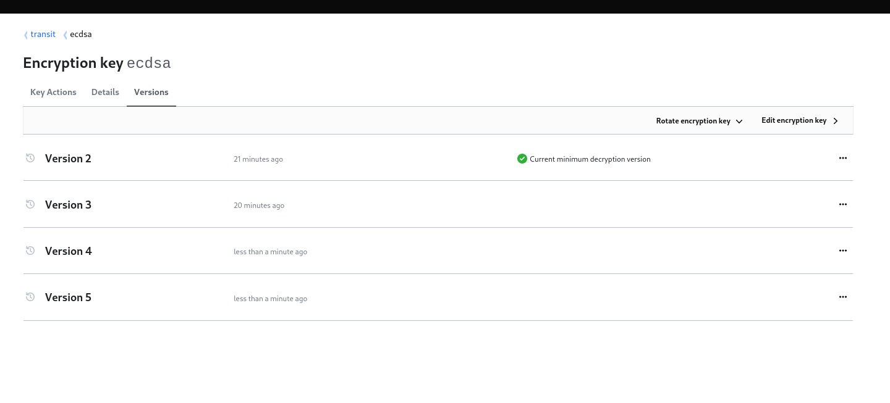

# OIDC Server Demo Integration


## Prepare OIDC Server

* Generate a token with transit `read`, `sign` and `verify` capability on the `rsa` and `ecdsa` key

```bash
vault token create   -role=transit-jwt-server


Key                  Value
---                  -----
token                hvs.CAESIMkcezbawizFPgOBE0T6ET-L6a2fKkT7TIxP_zTh4urkGh4KHGh2cy5OSnFIRDYwZmw1SDNUMFJhWUpJUUtaUEU
token_accessor       uwfYZHObZwQ2FGmPKseHuYwW
token_duration       24h
token_renewable      true
token_policies       ["transit/ecdsa/read" "transit/ecdsa/sign" "transit/ecdsa/verify" "transit/rsa/read" "transit/rsa/sign" "transit/rsa/verify"]
identity_policies    []
policies             ["transit/ecdsa/read" "transit/ecdsa/sign" "transit/ecdsa/verify" "transit/rsa/read" "transit/rsa/sign" "transit/rsa/verify"]

```


* Add this configuration block into your oidc-server (version >= v0.6.1 ) config file (more details in oidc-server [doc](https://vdbulcke.github.io/oidc-server-demo/config/))

>NOTE: you can also leave the `address:` and `token:` property commented and set the standard vault environment variables  `VAULT_ADDR` and `VAULT_TOKEN` 
```yaml
##
## Vault Crypto Backend
##
### Since: v0.6.0
### Use vault Transit secret engine 
### for JWT signing and verifying
vault_crypto_backend: 
  ## The vault API address
  ## NOTE: can be specified with 'VAULT_ADDR' env var
  address: http://127.0.0.1:8200 
  ## The vault authentication token 
  ## WARNING must have the permission to 'read', 'sign', 'verify'
  ##         the transit key
  ## NOTE:can be specified with 'VAULT_TOKEN' env var
  token: "hvs.CAESIMkcezbawizFPgOBE0T6ET-L6a2fKkT7TIxP_zTh4urkGh4KHGh2cy5OSnFIRDYwZmw1SDNUMFJhWUpJUUtaUEU"

  ## JWT signing alg 
  ### Warning: this must be a supported 
  ###          algorithm by your transit key
  ### Valid values: 
  ###  - RS256 RS384 RS512 ES256 ES384 ES512
  jwt_signing_alg: RS256

  ## Vault Transit Key name
  transit_key: rsa


  ## Vault Transit Mount 
  ### Default: transit/
  # transit_mount: alternative/path

  ## Backend key sync period duration
  ##   period at which the backend read the 
  ##   transit key info to detect if there has been 
  ##   key rotation
  ### WARNING: valid duration are 's', 'm', 'h'
  ### Default: 5m
  sync_duration: 1m

```
* Perform OIDC Authorization code flow with `oidc-client` (https://vdbulcke.github.io/oidc-client-demo/), you see that the `kid` is coming from the transit backend the version 1 of the key:


```
...
2022-10-29T16:28:39.389+0200 [INFO]  oidc-client: IDToken header:
  header=
  | {
  |     "alg": "RS256",
  |     "kid": "transit:rsa:v:1",
  |     "typ": "JWT"
  | }
...
```


* Lookup JWKS and see there is only one key in use (so far)
```bash
http GET http://127.0.0.1:5557/oidc/.well-known/jwks.json


HTTP/1.1 200 OK
Cache-Control: no-cache, no-store, must-revalidate, max-age=0
Content-Length: 775
Content-Type: application/json
Date: Sat, 29 Oct 2022 14:32:55 GMT
Pragma: no-cache

{
    "keys": [
        {
            "alg": "RS256",
            "e": "AQAB",
            "kid": "transit:rsa:v:1",
            "kty": "RSA",
            "n": "tAbGsdYSvjJjYfNndIgjaB1VJ5ax10eEW31KXShNWG_tMN1EiIS7sUZqSkb2svq8iMdLqB2Ag5Z9qISI8LaCUR1n1BG1eLdf7jIJB58oeWL2Kw8b197YDYVxNcP7qNwjDshEl6RCBqqf3NiwX4fY_ExDmSDaam_GKR55qkSyP80nocUzQT0TJtnHUdIDfwKQY4rvTiCZdnPdAzSDzr7alji78crllzrDa_D92KbobVXAXyT2SoEIvpXhqkj-ABFsM8u9LhsGUyMkiyPgh7dVm5AYtNg64cHsRMCPEFdtlnAjeqGRjJFqFm9xPiwRdBJI17aGb-y4BezdGlWIIXZwLRtVtTVrYiZtXzquST44wIJ0uAxjTsQX8WWnPJYUkQT2QtkY9cck27IbOMEUix0yGzt9rrDP6osK6bWIyXIRWMbDylO8GyWVf4_nqSC6hHJBagTsKAUSmDqEimp34fgVjFfY7ilCPebalPCwIvB7LbGFnUabn-Gb3aAv2ho4E0VpqTXuqzi1smJLJ8UQtxIwc83RJ27IqcF54ZV1MmFGVJJQ1LvXwkN-LjLrsT9KD7-mNqmS4lnStGV5CEkegT_ihi9wgxTPcgMS22mQ-L81DmsCDgh73WVgNkcj7Ov7mjateKQTJCkauGbWTcAa-EvqNTXMcD8RVCmF7dQFbzuLDRc",
            "use": "sig"
        }
    ]
}

```

## Key rotation

* generate a token for the transit operator 
```bash
vault token create   -role=transit-operator  

WARNING! The following warnings were returned from Vault:

  * TTL of "768h" exceeded the effective max_ttl of "32h"; TTL value is capped
  accordingly

Key                  Value
---                  -----
token                hvs.CAESIJroPe3HdcqPoJ_to-m0l9ZLPumgqdJcyyNFUWpBCpICGh4KHGh2cy5rblV0cEh6VGhPcWdWSndTSEdMY3pNMm4
token_accessor       ouvd5ROSyQf5AWJ34QpFj0qW
token_duration       32h
token_renewable      true
token_policies       ["default" "transit/ecdsa/read" "transit/ecdsa/rotate" "transit/ecdsa/trim" "transit/operator" "transit/rsa/read" "transit/rsa/rotate" "transit/rsa/trim" "transit/rsa/update"]
identity_policies    []
policies             ["default" "transit/ecdsa/read" "transit/ecdsa/rotate" "transit/ecdsa/trim" "transit/operator" "transit/rsa/read" "transit/rsa/rotate" "transit/rsa/trim" "transit/rsa/update"]
```


* Login to vault cli with the operator token 

```bash
vault login                                    

Token (will be hidden): 
Success! You are now authenticated. The token information displayed below
is already stored in the token helper. You do NOT need to run "vault login"
again. Future Vault requests will automatically use this token.

Key                  Value
---                  -----
token                hvs.CAESIJroPe3HdcqPoJ_to-m0l9ZLPumgqdJcyyNFUWpBCpICGh4KHGh2cy5rblV0cEh6VGhPcWdWSndTSEdMY3pNMm4
token_accessor       ouvd5ROSyQf5AWJ34QpFj0qW
token_duration       31h54m53s
token_renewable      true
token_policies       ["default" "transit/ecdsa/read" "transit/ecdsa/rotate" "transit/ecdsa/trim" "transit/operator" "transit/rsa/read" "transit/rsa/rotate" "transit/rsa/trim" "transit/rsa/update"]
identity_policies    []
policies             ["default" "transit/ecdsa/read" "transit/ecdsa/rotate" "transit/ecdsa/trim" "transit/operator" "transit/rsa/read" "transit/rsa/rotate" "transit/rsa/trim" "transit/rsa/update"]

```

* list transit key

```bash
vault list transit/keys

Keys
----
demo
ecdsa
rsa

```

* Read `rsa` transit key

```bash
vault read transit/keys/rsa 

Key                       Value
---                       -----
allow_plaintext_backup    false
auto_rotate_period        0s
deletion_allowed          false
derived                   false
exportable                false
imported_key              false
keys                      map[1:map[creation_time:2022-10-29T16:21:16.404387631+02:00 name:rsa-4096 public_key:-----BEGIN PUBLIC KEY-----
MIICIjANBgkqhkiG9w0BAQEFAAOCAg8AMIICCgKCAgEAtAbGsdYSvjJjYfNndIgj
aB1VJ5ax10eEW31KXShNWG/tMN1EiIS7sUZqSkb2svq8iMdLqB2Ag5Z9qISI8LaC
UR1n1BG1eLdf7jIJB58oeWL2Kw8b197YDYVxNcP7qNwjDshEl6RCBqqf3NiwX4fY
/ExDmSDaam/GKR55qkSyP80nocUzQT0TJtnHUdIDfwKQY4rvTiCZdnPdAzSDzr7a
lji78crllzrDa/D92KbobVXAXyT2SoEIvpXhqkj+ABFsM8u9LhsGUyMkiyPgh7dV
m5AYtNg64cHsRMCPEFdtlnAjeqGRjJFqFm9xPiwRdBJI17aGb+y4BezdGlWIIXZw
LRtVtTVrYiZtXzquST44wIJ0uAxjTsQX8WWnPJYUkQT2QtkY9cck27IbOMEUix0y
Gzt9rrDP6osK6bWIyXIRWMbDylO8GyWVf4/nqSC6hHJBagTsKAUSmDqEimp34fgV
jFfY7ilCPebalPCwIvB7LbGFnUabn+Gb3aAv2ho4E0VpqTXuqzi1smJLJ8UQtxIw
c83RJ27IqcF54ZV1MmFGVJJQ1LvXwkN+LjLrsT9KD7+mNqmS4lnStGV5CEkegT/i
hi9wgxTPcgMS22mQ+L81DmsCDgh73WVgNkcj7Ov7mjateKQTJCkauGbWTcAa+Evq
NTXMcD8RVCmF7dQFbzuLDRcCAwEAAQ==
-----END PUBLIC KEY-----
]]
latest_version            1
min_available_version     0
min_decryption_version    1
min_encryption_version    0
name                      rsa
supports_decryption       true
supports_derivation       false
supports_encryption       true
supports_signing          true
type                      rsa-4096

```

* Rotate `rsa` key  (must use `-force` because there is no input parameter to the write request)

```bash
vault write -force transit/keys/rsa/rotate

Success! Data written to: transit/keys/rsa/rotate
```

* Read again the `rsa` key, there is another key version

```bash
vault read transit/keys/rsa              

Key                       Value
---                       -----
allow_plaintext_backup    false
auto_rotate_period        0s
deletion_allowed          false
derived                   false
exportable                false
imported_key              false
keys                      map[1:map[creation_time:2022-10-29T16:21:16.404387631+02:00 name:rsa-4096 public_key:-----BEGIN PUBLIC KEY-----
MIICIjANBgkqhkiG9w0BAQEFAAOCAg8AMIICCgKCAgEAtAbGsdYSvjJjYfNndIgj
aB1VJ5ax10eEW31KXShNWG/tMN1EiIS7sUZqSkb2svq8iMdLqB2Ag5Z9qISI8LaC
UR1n1BG1eLdf7jIJB58oeWL2Kw8b197YDYVxNcP7qNwjDshEl6RCBqqf3NiwX4fY
/ExDmSDaam/GKR55qkSyP80nocUzQT0TJtnHUdIDfwKQY4rvTiCZdnPdAzSDzr7a
lji78crllzrDa/D92KbobVXAXyT2SoEIvpXhqkj+ABFsM8u9LhsGUyMkiyPgh7dV
m5AYtNg64cHsRMCPEFdtlnAjeqGRjJFqFm9xPiwRdBJI17aGb+y4BezdGlWIIXZw
LRtVtTVrYiZtXzquST44wIJ0uAxjTsQX8WWnPJYUkQT2QtkY9cck27IbOMEUix0y
Gzt9rrDP6osK6bWIyXIRWMbDylO8GyWVf4/nqSC6hHJBagTsKAUSmDqEimp34fgV
jFfY7ilCPebalPCwIvB7LbGFnUabn+Gb3aAv2ho4E0VpqTXuqzi1smJLJ8UQtxIw
c83RJ27IqcF54ZV1MmFGVJJQ1LvXwkN+LjLrsT9KD7+mNqmS4lnStGV5CEkegT/i
hi9wgxTPcgMS22mQ+L81DmsCDgh73WVgNkcj7Ov7mjateKQTJCkauGbWTcAa+Evq
NTXMcD8RVCmF7dQFbzuLDRcCAwEAAQ==
-----END PUBLIC KEY-----
] 2:map[creation_time:2022-10-29T16:40:47.703911294+02:00 name:rsa-4096 public_key:-----BEGIN PUBLIC KEY-----
MIICIjANBgkqhkiG9w0BAQEFAAOCAg8AMIICCgKCAgEAt8rkq+sR/wr5SEHX6kvb
d8U7BvyNC5+olt7ne9afa5paF9wLOy5BUJFFXvlpaGaY7CAZUSLbusPDdrKaviiQ
Dvp1t48vPhTTqV0F/ZNtsfU+KIWEaKQ1Ci3YDJh8IPW4ScZEoNZP54voNhfvzIlB
X3bq2BlexwQW/zVNqrHOPUxsYa+5kHgRynnB+IGgM9et2aX5jwni1WbC4xpzCwVq
H1vu+/Yt3cfx0y8DJEUOUZt0ENLj1aT7Nl+Cl2mLDBElMjrlLtp/rHm5VRtrEtEz
qr1Nere9+hOMRyaMrf2kFDb4DiV2vCftIUc0Fci5OPLFjSLWBc4ZotvqqZ3yyvfO
dJipKzYX76TzlFppBVsMO5AQnFRrtAvWj5i/g+tp8O0V5SFmZxGCt3nz2XQZ5jHq
xjJsw18ZgFRZ6eaa+4R0GnwfizlSJcWl5SBLYlbhorXILPLcbMIEAAD3czUfb4pK
ifjldgmy1Tv44Pi12pUW8TYUvjzA4N+f+9kHq1HS7zoD726K4LzYKfYrobdVDTaE
Bm1kyTyXByILj4hDUSA9Go02BSY37IMHzrIAlit754fWfDTZsVbgZ1+DIyHxKIy5
he6faPM4JoKySULWULikPJ0fKiooGIL7cBnCa/o8WopLECKrRQhazFS19iGKy2+r
3NfVPmW4WV6CE71leG94O/sCAwEAAQ==
-----END PUBLIC KEY-----
]]
latest_version            2
min_available_version     0
min_decryption_version    1
min_encryption_version    0
name                      rsa
supports_decryption       true
supports_derivation       false
supports_encryption       true
supports_signing          true
type                      rsa-4096
```


* After a bit of time (corresponding to `sync_duration: 1m`) the oidc-server picked up that a new key version is available

```
http GET http://127.0.0.1:5557/oidc/.well-known/jwks.json

HTTP/1.1 200 OK
Cache-Control: no-cache, no-store, must-revalidate, max-age=0
Content-Length: 1540
Content-Type: application/json
Date: Sat, 29 Oct 2022 14:42:21 GMT
Pragma: no-cache

{
    "keys": [
        {
            "alg": "RS256",
            "e": "AQAB",
            "kid": "transit:rsa:v:1",
            "kty": "RSA",
            "n": "tAbGsdYSvjJjYfNndIgjaB1VJ5ax10eEW31KXShNWG_tMN1EiIS7sUZqSkb2svq8iMdLqB2Ag5Z9qISI8LaCUR1n1BG1eLdf7jIJB58oeWL2Kw8b197YDYVxNcP7qNwjDshEl6RCBqqf3NiwX4fY_ExDmSDaam_GKR55qkSyP80nocUzQT0TJtnHUdIDfwKQY4rvTiCZdnPdAzSDzr7alji78crllzrDa_D92KbobVXAXyT2SoEIvpXhqkj-ABFsM8u9LhsGUyMkiyPgh7dVm5AYtNg64cHsRMCPEFdtlnAjeqGRjJFqFm9xPiwRdBJI17aGb-y4BezdGlWIIXZwLRtVtTVrYiZtXzquST44wIJ0uAxjTsQX8WWnPJYUkQT2QtkY9cck27IbOMEUix0yGzt9rrDP6osK6bWIyXIRWMbDylO8GyWVf4_nqSC6hHJBagTsKAUSmDqEimp34fgVjFfY7ilCPebalPCwIvB7LbGFnUabn-Gb3aAv2ho4E0VpqTXuqzi1smJLJ8UQtxIwc83RJ27IqcF54ZV1MmFGVJJQ1LvXwkN-LjLrsT9KD7-mNqmS4lnStGV5CEkegT_ihi9wgxTPcgMS22mQ-L81DmsCDgh73WVgNkcj7Ov7mjateKQTJCkauGbWTcAa-EvqNTXMcD8RVCmF7dQFbzuLDRc",
            "use": "sig"
        },
        {
            "alg": "RS256",
            "e": "AQAB",
            "kid": "transit:rsa:v:2",
            "kty": "RSA",
            "n": "t8rkq-sR_wr5SEHX6kvbd8U7BvyNC5-olt7ne9afa5paF9wLOy5BUJFFXvlpaGaY7CAZUSLbusPDdrKaviiQDvp1t48vPhTTqV0F_ZNtsfU-KIWEaKQ1Ci3YDJh8IPW4ScZEoNZP54voNhfvzIlBX3bq2BlexwQW_zVNqrHOPUxsYa-5kHgRynnB-IGgM9et2aX5jwni1WbC4xpzCwVqH1vu-_Yt3cfx0y8DJEUOUZt0ENLj1aT7Nl-Cl2mLDBElMjrlLtp_rHm5VRtrEtEzqr1Nere9-hOMRyaMrf2kFDb4DiV2vCftIUc0Fci5OPLFjSLWBc4ZotvqqZ3yyvfOdJipKzYX76TzlFppBVsMO5AQnFRrtAvWj5i_g-tp8O0V5SFmZxGCt3nz2XQZ5jHqxjJsw18ZgFRZ6eaa-4R0GnwfizlSJcWl5SBLYlbhorXILPLcbMIEAAD3czUfb4pKifjldgmy1Tv44Pi12pUW8TYUvjzA4N-f-9kHq1HS7zoD726K4LzYKfYrobdVDTaEBm1kyTyXByILj4hDUSA9Go02BSY37IMHzrIAlit754fWfDTZsVbgZ1-DIyHxKIy5he6faPM4JoKySULWULikPJ0fKiooGIL7cBnCa_o8WopLECKrRQhazFS19iGKy2-r3NfVPmW4WV6CE71leG94O_s",
            "use": "sig"
        }
    ]
}
```


* After a grace period (waiting all jwt tokens signed with the version 1 of the key have expired), you can "soft delete" the version 1 of the key by setting the `min_decryption_version` to 2. Since the key is managed via terraform we will use terraform to update the key (in [transi_key.tf](../../transit_key.tf)):

```hcl
module "transit_rsa_key" {
  source = "./modules/transit-key"

  transit_mount_path = vault_mount.transit.path
  key_name           = "rsa"
  key_type           = "rsa-4096"

  ## After key rotation, use those variables
  ## to disallowed using older keys
  min_decryption_version = 2
  min_encryption_version = 2
}

```

* after `terraform apply` read the key again. Only the second key version is readable: 
```bash
 vault read transit/keys/rsa


Key                       Value
---                       -----
allow_plaintext_backup    false
auto_rotate_period        0s
deletion_allowed          false
derived                   false
exportable                false
imported_key              false
keys                      map[2:map[creation_time:2022-10-29T16:40:47.703911294+02:00 name:rsa-4096 public_key:-----BEGIN PUBLIC KEY-----
MIICIjANBgkqhkiG9w0BAQEFAAOCAg8AMIICCgKCAgEAt8rkq+sR/wr5SEHX6kvb
d8U7BvyNC5+olt7ne9afa5paF9wLOy5BUJFFXvlpaGaY7CAZUSLbusPDdrKaviiQ
Dvp1t48vPhTTqV0F/ZNtsfU+KIWEaKQ1Ci3YDJh8IPW4ScZEoNZP54voNhfvzIlB
X3bq2BlexwQW/zVNqrHOPUxsYa+5kHgRynnB+IGgM9et2aX5jwni1WbC4xpzCwVq
H1vu+/Yt3cfx0y8DJEUOUZt0ENLj1aT7Nl+Cl2mLDBElMjrlLtp/rHm5VRtrEtEz
qr1Nere9+hOMRyaMrf2kFDb4DiV2vCftIUc0Fci5OPLFjSLWBc4ZotvqqZ3yyvfO
dJipKzYX76TzlFppBVsMO5AQnFRrtAvWj5i/g+tp8O0V5SFmZxGCt3nz2XQZ5jHq
xjJsw18ZgFRZ6eaa+4R0GnwfizlSJcWl5SBLYlbhorXILPLcbMIEAAD3czUfb4pK
ifjldgmy1Tv44Pi12pUW8TYUvjzA4N+f+9kHq1HS7zoD726K4LzYKfYrobdVDTaE
Bm1kyTyXByILj4hDUSA9Go02BSY37IMHzrIAlit754fWfDTZsVbgZ1+DIyHxKIy5
he6faPM4JoKySULWULikPJ0fKiooGIL7cBnCa/o8WopLECKrRQhazFS19iGKy2+r
3NfVPmW4WV6CE71leG94O/sCAwEAAQ==
-----END PUBLIC KEY-----
]]
latest_version            2
min_available_version     0
min_decryption_version    2
min_encryption_version    2
name                      rsa
supports_decryption       true
supports_derivation       false
supports_encryption       true
supports_signing          true
type                      rsa-4096

```

* lookup again the JWKS of oidc-server, to confirm the change:

```bash
 http GET http://127.0.0.1:5557/oidc/.well-known/jwks.json

HTTP/1.1 200 OK
Cache-Control: no-cache, no-store, must-revalidate, max-age=0
Content-Length: 775
Content-Type: application/json
Date: Sat, 29 Oct 2022 14:50:29 GMT
Pragma: no-cache

{
    "keys": [
        {
            "alg": "RS256",
            "e": "AQAB",
            "kid": "transit:rsa:v:2",
            "kty": "RSA",
            "n": "t8rkq-sR_wr5SEHX6kvbd8U7BvyNC5-olt7ne9afa5paF9wLOy5BUJFFXvlpaGaY7CAZUSLbusPDdrKaviiQDvp1t48vPhTTqV0F_ZNtsfU-KIWEaKQ1Ci3YDJh8IPW4ScZEoNZP54voNhfvzIlBX3bq2BlexwQW_zVNqrHOPUxsYa-5kHgRynnB-IGgM9et2aX5jwni1WbC4xpzCwVqH1vu-_Yt3cfx0y8DJEUOUZt0ENLj1aT7Nl-Cl2mLDBElMjrlLtp_rHm5VRtrEtEzqr1Nere9-hOMRyaMrf2kFDb4DiV2vCftIUc0Fci5OPLFjSLWBc4ZotvqqZ3yyvfOdJipKzYX76TzlFppBVsMO5AQnFRrtAvWj5i_g-tp8O0V5SFmZxGCt3nz2XQZ5jHqxjJsw18ZgFRZ6eaa-4R0GnwfizlSJcWl5SBLYlbhorXILPLcbMIEAAD3czUfb4pKifjldgmy1Tv44Pi12pUW8TYUvjzA4N-f-9kHq1HS7zoD726K4LzYKfYrobdVDTaEBm1kyTyXByILj4hDUSA9Go02BSY37IMHzrIAlit754fWfDTZsVbgZ1-DIyHxKIy5he6faPM4JoKySULWULikPJ0fKiooGIL7cBnCa_o8WopLECKrRQhazFS19iGKy2-r3NfVPmW4WV6CE71leG94O_s",
            "use": "sig"
        }
    ]
}

```

>IMPORTANT: at this point you can still rollback to the verison 1 of the key by resetting `min_decryption_version` setting to 1.

* **Permanently** delete version 1 of the key, 

```bash
vault write transit/keys/rsa/trim min_available_version=2

Success! Data written to: transit/keys/rsa/trim
```

* read key again
```bash
vault read transit/keys/rsa            


Key                       Value
---                       -----
allow_plaintext_backup    false
auto_rotate_period        0s
deletion_allowed          false
derived                   false
exportable                false
imported_key              false
keys                      map[2:map[creation_time:2022-10-29T16:40:47.703911294+02:00 name:rsa-4096 public_key:-----BEGIN PUBLIC KEY-----
MIICIjANBgkqhkiG9w0BAQEFAAOCAg8AMIICCgKCAgEAt8rkq+sR/wr5SEHX6kvb
d8U7BvyNC5+olt7ne9afa5paF9wLOy5BUJFFXvlpaGaY7CAZUSLbusPDdrKaviiQ
Dvp1t48vPhTTqV0F/ZNtsfU+KIWEaKQ1Ci3YDJh8IPW4ScZEoNZP54voNhfvzIlB
X3bq2BlexwQW/zVNqrHOPUxsYa+5kHgRynnB+IGgM9et2aX5jwni1WbC4xpzCwVq
H1vu+/Yt3cfx0y8DJEUOUZt0ENLj1aT7Nl+Cl2mLDBElMjrlLtp/rHm5VRtrEtEz
qr1Nere9+hOMRyaMrf2kFDb4DiV2vCftIUc0Fci5OPLFjSLWBc4ZotvqqZ3yyvfO
dJipKzYX76TzlFppBVsMO5AQnFRrtAvWj5i/g+tp8O0V5SFmZxGCt3nz2XQZ5jHq
xjJsw18ZgFRZ6eaa+4R0GnwfizlSJcWl5SBLYlbhorXILPLcbMIEAAD3czUfb4pK
ifjldgmy1Tv44Pi12pUW8TYUvjzA4N+f+9kHq1HS7zoD726K4LzYKfYrobdVDTaE
Bm1kyTyXByILj4hDUSA9Go02BSY37IMHzrIAlit754fWfDTZsVbgZ1+DIyHxKIy5
he6faPM4JoKySULWULikPJ0fKiooGIL7cBnCa/o8WopLECKrRQhazFS19iGKy2+r
3NfVPmW4WV6CE71leG94O/sCAwEAAQ==
-----END PUBLIC KEY-----
]]
latest_version            2
min_available_version     2
min_decryption_version    2
min_encryption_version    2
name                      rsa
supports_decryption       true
supports_derivation       false
supports_encryption       true
supports_signing          true
type                      rsa-4096
```


All those operation can also be perform via the UI. But is it stronly recommended to use terraform for managing keu version configuration.
